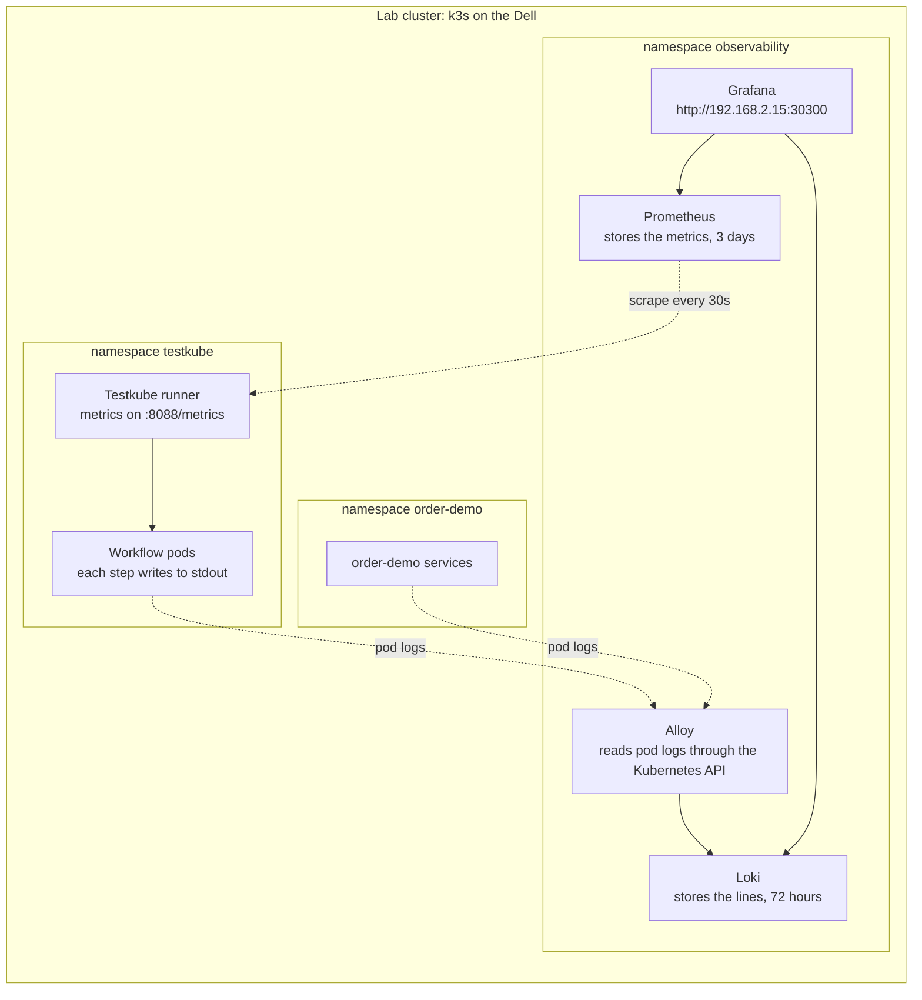

# Testkube workflow logs and runner metrics in Grafana (lab)

This folder installs Loki, Prometheus, Grafana Alloy and Grafana on the lab
cluster. Two things then show up in Grafana:

- the output of every Testkube workflow step, next to the order-demo services'
  own logs (Alloy reads the pod logs, Loki stores them)
- the Testkube runner's own metrics: is the runner up, how many runs passed and
  failed, how long runs and steps took (Prometheus reads them from the runner)

It proves one thing: Testkube needs no special feature for either. Each
workflow step runs in an ordinary pod and writes to standard output, so the
log collector a cluster already runs picks it up like any other pod. The runner
serves Prometheus metrics on its own port, so the Prometheus a cluster already
runs only needs one scrape job.

These files sit outside `k8s/`, so the `order-demo-ui-staging` Argo CD app does
not sync them. They are installed with Helm, and removed the same way.

## The frame



## What gets installed

| Piece | Helm chart, pinned | What it does here | Values file |
|---|---|---|---|
| Loki | `grafana-community/loki` 18.13.8 | One pod. Stores log lines on a 5Gi volume and keeps them for 72 hours. | `loki-values.yaml` |
| Prometheus | `prometheus-community/prometheus` 29.36.0 | One pod. Reads the runner's metrics every 30 seconds and keeps them for 3 days on a 5Gi volume. | `prometheus-values.yaml` |
| Alloy | `grafana/alloy` 1.13.0 | One pod. Reads pod logs in `testkube` and `order-demo`, labels them with the workflow name, drops Testkube's step-marker lines, sends them to Loki. | `alloy-values.yaml` |
| Grafana | `grafana-community/grafana` 13.3.0 | One pod. Loki and Prometheus as data sources, three dashboards in the Testkube folder, open at http://192.168.2.15:30300. | `grafana-values.yaml` |

Every value in the four files has a comment saying why it is there and where it
comes from.

The three dashboards:

- **Testkube workflow logs**: log lines per workflow, the step output itself,
  and the order-demo services' logs underneath.
- **Testkube runs**: runner up or down, runs passed and failed in the last 24
  hours, average run time per workflow, step durations.
- **Testkube starter dashboard**: the dashboard Testkube publishes in its repo
  (`assets/grafana-dasboard.json`), pointed at the lab's Prometheus.

## Before you start

- Run the commands from the root of this repository, on this branch.
- `kubectl --context default get nodes` shows `lws-tklab` Ready.
- `helm version` prints a version (the runner was installed with Helm, so it is there).
- **The node has room for four more pods.** k3s allows 110 pods on a node by
  default. This setup adds four. Compare the two numbers:

  ```bash
  kubectl --context default get node lws-tklab -o jsonpath='{.status.allocatable.pods}'; echo
  kubectl --context default get pods -A --field-selector=status.phase=Running --no-headers | wc -l
  ```

  Leave room for Testkube too: the `infra-health-suite` run needs six pods at
  the same moment (the suite plus its five checks). On Oct 8 2026 the Dell sat
  at 110 of 110 after this install, and the suite failed (see "What could go
  wrong"). Removing the five feature vClusters the same day freed 65 pods.

## Step 1: add the chart repositories

```bash
helm repo add grafana https://grafana.github.io/helm-charts
helm repo add grafana-community https://grafana-community.github.io/helm-charts
helm repo add prometheus-community https://prometheus-community.github.io/helm-charts
helm repo update
```

Check: `helm search repo grafana-community/loki --version 18.13.8` prints one line.

## Step 2: install Loki

```bash
helm upgrade --install loki grafana-community/loki --version 18.13.8 \
  --kube-context default --namespace observability --create-namespace \
  -f observability/loki-values.yaml
```

Check: `kubectl --context default -n observability get pods` shows `loki-0`
Running 2/2 after a minute (Loki plus its rules sidecar). Then ask Loki itself:

```bash
kubectl --context default -n observability port-forward svc/loki 3100:3100
# in a second terminal
curl -s localhost:3100/ready   # prints: ready
```

## Step 3: install Prometheus

```bash
helm upgrade --install prometheus prometheus-community/prometheus --version 29.36.0 \
  --kube-context default --namespace observability \
  -f observability/prometheus-values.yaml
```

Check: the `prometheus-server-...` pod is Running 2/2 (Prometheus plus its
config reloader). Then look at the runner target:

```bash
kubectl --context default -n observability port-forward svc/prometheus-server 9090:80
# open http://localhost:9090/targets
```

The `testkube-runner` job shows one target, `UP`.

## Step 4: install Alloy

```bash
helm upgrade --install alloy grafana/alloy --version 1.13.0 \
  --kube-context default --namespace observability \
  -f observability/alloy-values.yaml
```

Check: the `alloy-...` pod is Running 2/2 (Alloy plus its config reloader), and
this prints nothing:

```bash
kubectl --context default -n observability logs deploy/alloy -c alloy | grep 'level=error'
```

Lines with `level=warn` and `tailer stopped; will retry ... not found` are
normal. They appear each time a workflow pod is deleted after its run.

## Step 5: install Grafana

```bash
helm upgrade --install grafana grafana-community/grafana --version 13.3.0 \
  --kube-context default --namespace observability \
  -f observability/grafana-values.yaml
```

Check: the `grafana-...` pod is Running 1/1, and http://192.168.2.15:30300
opens Grafana without a login. Viewing needs no login. To change anything, log
in as `admin` with the password the chart generated:

```bash
kubectl --context default -n observability get secret grafana \
  -o jsonpath='{.data.admin-password}' | base64 -d; echo
```

## Step 6: prove it

1. Start a run. In the Testkube dashboard open `infra-health-suite` and click
   Run, or run `testkube run testworkflow infra-health-suite --watch`. It takes
   about 15 seconds when the node has room.
2. Open Dashboards → Testkube → **Testkube workflow logs**.
3. Open Dashboards → Testkube → **Testkube runs**.

Pass when all four are true:

- The Workflow list shows the workflows that ran, for example
  `infra-cluster-health`, `infra-network-check` and `infra-health-suite`.
- "Workflow step output" shows the lines from the run you just started, for
  example `OK - every node is Ready` and `OK - in-cluster DNS resolves`.
- No line starts with odd control characters. Those are Testkube's step markers,
  and Alloy drops them.
- On "Testkube runs" the Runner tile says Up, and the passed or failed count
  goes up within a minute of the run ending.

## What could go wrong

- **"Too many pods" and a failing capacity check.** The node has a pod limit
  (110 on k3s unless changed). When it is full, new workflow pods wait with the
  event `0/1 nodes are available: 1 Too many pods`, runs get slow, and
  `infra-capacity-check` fails with `FAIL - pods still waiting for a node`.
  The check is right: the cluster is out of room. Raise the node's pod limit or
  stop pods you do not need.
- **A very short workflow is missing from Loki.** Alloy reads logs through the
  Kubernetes API, and Testkube deletes a workflow pod a few seconds after its
  run. A step that finishes in two or three seconds can be gone before Alloy
  opens its log. Seen on the lab with `infra-postdeploy-smoke`. The step output
  is still in Testkube.
- **Chrome on the Mac cannot open http://192.168.2.15:30300.** If every address
  on the Dell fails in Chrome while other apps reach it, macOS is blocking
  Chrome from the local network: System Settings → Privacy & Security →
  Local Network → turn on Google Chrome, then restart Chrome.
- **The workflow label is empty.** The runner sets `testkube.io/workflow-name`
  on every workflow pod (in the Testkube source since at least 2.12.0, the
  version the lab runs). If the label is missing, the keep rule in
  `alloy-values.yaml` drops those pods. Remove that rule to see everything.
- **Loki is not ready.** It takes up to a minute after the pod starts. The
  volume comes from the default StorageClass (`kubectl get storageclass`, k3s
  local-path on the Dell).

## Remove it

```bash
helm uninstall grafana alloy prometheus loki --kube-context default --namespace observability
kubectl --context default delete namespace observability   # also removes the Loki and Prometheus volumes
```

## Not in this setup

- **A mark on dashboards for each run.** A Testkube webhook can post to
  Grafana's annotations API when a run ends.
- **Cluster metrics beyond containers.** `kube-state-metrics`, the node
  exporter, and the k3s API server and kubelet metrics are turned off in
  `prometheus-values.yaml`.

## Sources

- Testkube runner metrics: https://docs.testkube.io/articles/metrics
- Runner metric names: https://github.com/kubeshop/testkube/blob/main/internal/app/api/metrics/metrics.go
- Runner metrics port in its own chart: https://github.com/kubeshop/testkube/blob/main/k8s/helm/testkube-runner/templates/servicemonitor.yaml
- Starter dashboard: https://github.com/kubeshop/testkube/blob/main/assets/grafana-dasboard.json
- Testkube webhooks: https://docs.testkube.io/articles/webhooks
- Testkube step output goes to stdout: https://github.com/kubeshop/testkube/blob/main/cmd/testworkflow-init/output/stream.go
- Testkube workflow pod labels: https://github.com/kubeshop/testkube/blob/main/pkg/testworkflows/testworkflowprocessor/constants/constants.go
- Alloy, Kubernetes logs to Loki: https://grafana.com/docs/alloy/latest/collect/logs-in-kubernetes/
- Alloy drop stage (`older_than`): https://grafana.com/docs/alloy/latest/reference/components/loki/loki.process/
- Loki chart, moved to grafana-community: https://github.com/grafana-community/helm-charts/tree/main/charts/loki
- Prometheus chart: https://github.com/prometheus-community/helm-charts/tree/main/charts/prometheus
