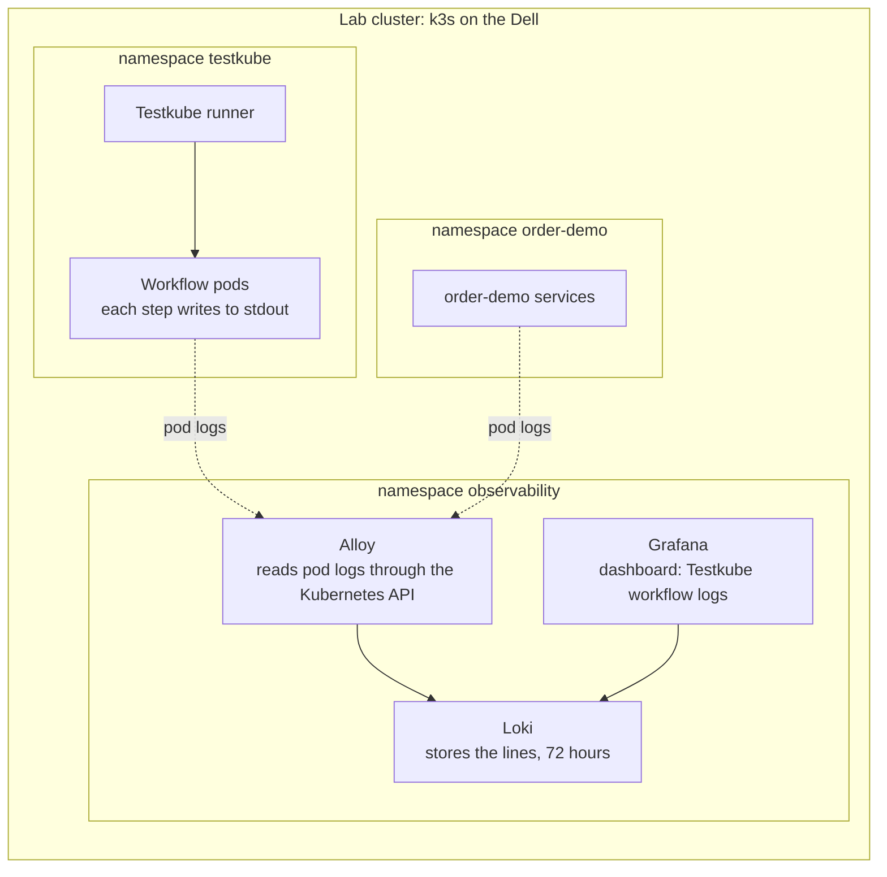

# Testkube workflow logs in Grafana (lab)

This folder installs Loki, Grafana Alloy and Grafana on the lab cluster, so the
output of every Testkube workflow step shows up in Grafana next to the
order-demo services' own logs.

It proves one thing: Testkube needs no special feature to get its logs into
Loki. Each workflow step runs in an ordinary pod and writes to standard output,
so the log collector a cluster already runs picks it up like any other pod.

These files sit outside `k8s/`, so the `order-demo-ui-staging` Argo CD app does
not sync them. They are installed by hand with Helm, and removed the same way.

## The frame



## What gets installed

| Piece | Helm chart, pinned | What it does here | Values file |
|---|---|---|---|
| Loki | `grafana-community/loki` 18.13.8 | One pod. Stores log lines on a 5Gi volume and keeps them for 72 hours. | `loki-values.yaml` |
| Alloy | `grafana/alloy` 1.13.0 | One pod. Reads pod logs in `testkube` and `order-demo`, labels them with the workflow name, drops Testkube's step-marker lines, sends them to Loki. | `alloy-values.yaml` |
| Grafana | `grafana-community/grafana` 13.3.0 | One pod. Loki as its data source, plus the "Testkube workflow logs" dashboard. | `grafana-values.yaml` |

Every value in the three files has a comment saying why it is there and where it
comes from.

## Before you start

- Run the commands from the root of this repository, on this branch.
- `kubectl --context default get nodes` shows `lws-tklab` Ready.
- `helm version` prints a version (the runner was installed with Helm, so it is there).

## Step 1: add the chart repositories

```bash
helm repo add grafana https://grafana.github.io/helm-charts
helm repo add grafana-community https://grafana-community.github.io/helm-charts
helm repo update
```

Check: `helm search repo grafana-community/loki --version 18.13.8` prints one line.

## Step 2: install Loki

```bash
helm upgrade --install loki grafana-community/loki --version 18.13.8 \
  --kube-context default --namespace observability --create-namespace \
  -f observability/loki-values.yaml
```

Check: `kubectl --context default -n observability get pods` shows `loki-0`
Running 1/1 after a minute. Then ask Loki itself:

```bash
kubectl --context default -n observability port-forward svc/loki 3100:3100
# in a second terminal
curl -s localhost:3100/ready   # prints: ready
```

## Step 3: install Alloy

```bash
helm upgrade --install alloy grafana/alloy --version 1.13.0 \
  --kube-context default --namespace observability \
  -f observability/alloy-values.yaml
```

Check: the `alloy-...` pod is Running 2/2 (Alloy plus its config reloader), and
this prints nothing:

```bash
kubectl --context default -n observability logs deploy/alloy -c alloy | grep 'level=error'
```

Optional: `kubectl --context default -n observability port-forward deploy/alloy 12345:12345`
and open http://localhost:12345 to see the five pipeline pieces, each one green.

## Step 4: install Grafana

```bash
helm upgrade --install grafana grafana-community/grafana --version 13.3.0 \
  --kube-context default --namespace observability \
  -f observability/grafana-values.yaml
```

Check: the `grafana-...` pod is Running 1/1.

## Step 5: prove it

1. Start a run. In the Testkube dashboard open `infra-health-suite` and click
   Run, or run `testkube run testworkflow infra-health-suite --watch`. It takes
   about 15 seconds.
2. While it runs, look at the label Alloy uses:
   `kubectl --context default -n testkube get pods --show-labels | grep workflow-name`
3. Open Grafana:

   ```bash
   kubectl --context default -n observability port-forward svc/grafana 3000:80
   # admin password, generated by the chart
   kubectl --context default -n observability get secret grafana \
     -o jsonpath='{.data.admin-password}' | base64 -d; echo
   ```

   Go to http://localhost:3000, log in as `admin`, then open
   Dashboards → Testkube → Testkube workflow logs.

Pass when all three are true:

- The Workflow list shows the five workflows: `infra-cluster-health`,
  `infra-capacity-check`, `infra-network-check`, `infra-cert-expiry`,
  `infra-postdeploy-smoke`, plus `infra-health-suite`, whose own pod starts the
  other five.
- "Workflow step output" shows the lines from the run you just started, for
  example `OK - every node is Ready` and `OK - all order-demo services healthy`.
- No line starts with odd control characters. Those are Testkube's step markers,
  and Alloy drops them.

The bottom panel shows the order-demo services' own logs for the same minutes,
so a failing smoke check and the service it called sit on one screen.

## What could go wrong

- **No workflow pods in Loki.** Workflow pods live only as long as the run. If
  the list stays empty, look at the Alloy logs from step 3 first. Then compare
  a step's lines in Grafana with the same step's log in Testkube.
- **The workflow label is empty.** The runner sets `testkube.io/workflow-name`
  on every workflow pod (in the Testkube source since at least 2.12.0, the
  version the lab runs). Check step 5.2. If the label is missing, the keep rule
  in `alloy-values.yaml` drops those pods. Remove that rule to see everything.
- **Loki is not ready.** It takes up to a minute after the pod starts. The
  volume comes from the default StorageClass (`kubectl get storageclass`, k3s
  local-path on the Dell).

## Remove it

```bash
helm uninstall grafana alloy loki --kube-context default --namespace observability
kubectl --context default delete namespace observability   # also removes Loki's volume
```

## Not in this setup

- **Runner metrics in Grafana.** The runner chart has `prometheus.enabled`,
  which creates a ServiceMonitor. That needs the Prometheus Operator, which the
  lab does not run.
- **A mark on dashboards for each run.** A Testkube webhook can post to
  Grafana's annotations API when a run ends.

## Sources

- Testkube runner metrics: https://docs.testkube.io/articles/metrics
- Testkube webhooks: https://docs.testkube.io/articles/webhooks
- Testkube step output goes to stdout: https://github.com/kubeshop/testkube/blob/main/cmd/testworkflow-init/output/stream.go
- Testkube workflow pod labels: https://github.com/kubeshop/testkube/blob/main/pkg/testworkflows/testworkflowprocessor/constants/constants.go
- Alloy, Kubernetes logs to Loki: https://grafana.com/docs/alloy/latest/collect/logs-in-kubernetes/
- Loki chart, moved to grafana-community: https://github.com/grafana-community/helm-charts/tree/main/charts/loki
